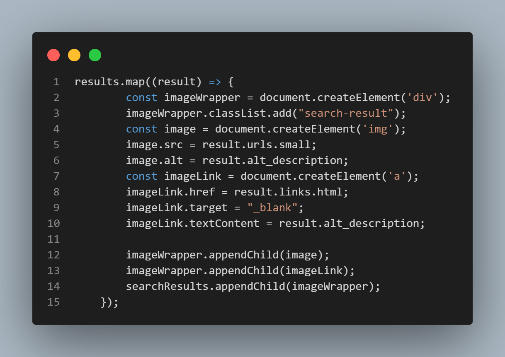
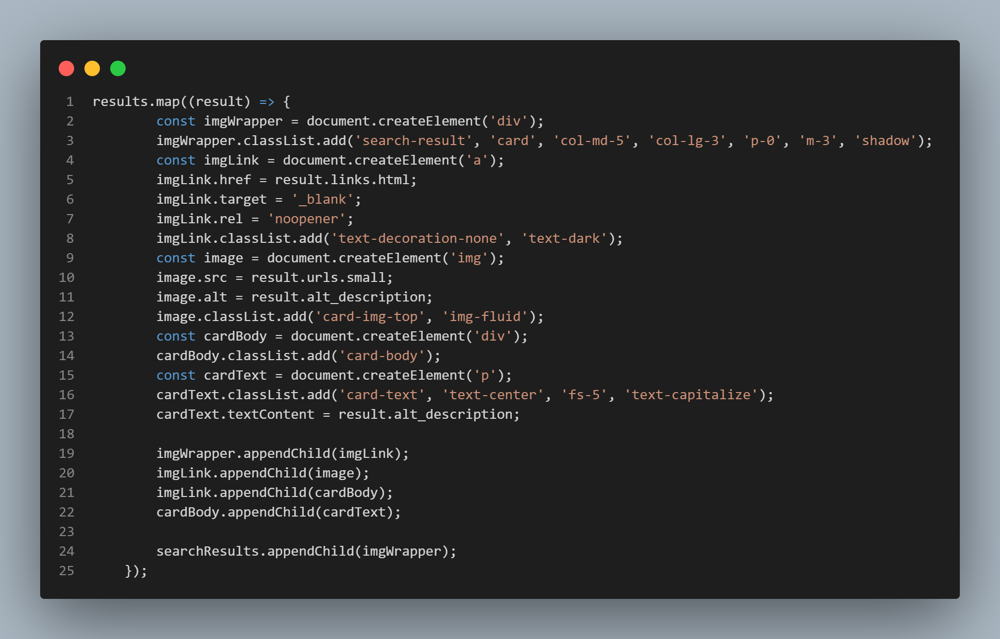

# Image Search App rebuilding with Bootstrap

I've followed buildng a JS Project | Image Search App with Pexels API [VIDEO](https://www.youtube.com/watch?v=oaliV2Dp7WQ&t=447s&ab_channel=Tech2etc)

I try rebuild a image search app using Bootstrap and here is what I learned. I tried to replace all CSS codes with Bootstrap and I faced a lot of challenges and learned a lot from it.

The real pain was when I try to manipulat DOM with event listensers. In Plain CSS version, I just had to create an element(div, a, image.etc), add a class and that's it. But when I try to do the same thing with Bootstrap, I have to add so many classes because as you know bootstrap is used by adding classes in an HTML element. I build all the grid system, marging, display all that stuffs in html elements so when I tried to manipulate from the resuls of calling and API, I have to readd all the bootstraps classes within the function. Here is the Screenshots of these two for better understanding.

#### DOM MANIPULATION WITH CSS

#### DOM Manipulation With Bootstrap

the main thing
